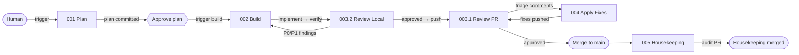

# Agent Harness — Overview

> **Type:** Context · **Audience:** All agents

This document is **orientation context**, not an executable skill. Your specific instructions for the current stage are in `001_plan`, `002_build`, `003_1_review_pr`, or `003_2_review_local`.

---

## Stages

| Stage | Skill File |
|-------|------------|
| Plan | `001_plan.md` |
| Build | `002_build.md` |
| Review (local) | `003_2_review_local.md` |
| Review (PR) | `003_1_review_pr.md` |
| Apply Fixes | `004_apply_fixes.md` |
| Housekeeping | `005_housekeeping.md` |

- **Plan** — Planning Agent + Human, read-only.
- **Build** — Coding Agent, edits + shell.
- **Review (local)** — Reviewer Agent runs 4 personas against `git diff HEAD` before pushing — tight loop.
- **Review (PR)** — Reviewer Agent runs the same 4 personas against `git diff main...HEAD` after pushing — fresh-context pass before merge.
- **Apply Fixes** — Fixer Agent reads triaged PR comments, applies changes, verifies locally, pushes. Bounded by the Impasse Protocol (3 rounds per thread).
- **Housekeeping** — Housekeeping Agent sweeps deferred/dismissed findings into a `housekeeping_audit.md`, archives the exec-plan, syncs the debt file, and promotes correction patterns. Final stage of the feature lifecycle.

Every stage runs locally in this template. Multi-agent fan-out and cloud reviewers (running personas in separate isolated runtimes) live in larger variants — the loop-closing stages (apply-fixes, housekeeping) ship here.

The two review modes share personas (QA, Code Quality, Security, Architecture) and the Evidence Rule.

---

## Flow

---

## Key Concepts

- **Skills define behaviour.** Each agent adopts a skill that specifies what to do, what context it needs, and what outputs it produces.
- **`AGENTS.md` is the entry point.** All agents start there.
- **Artifacts travel on the branch.** The plan lives under `harness/exec-plans/NNN-short-desc/`, committed to the branch.
- **Loops are bounded.** Build runs until checks pass. Review terminates when the human approves the findings.
